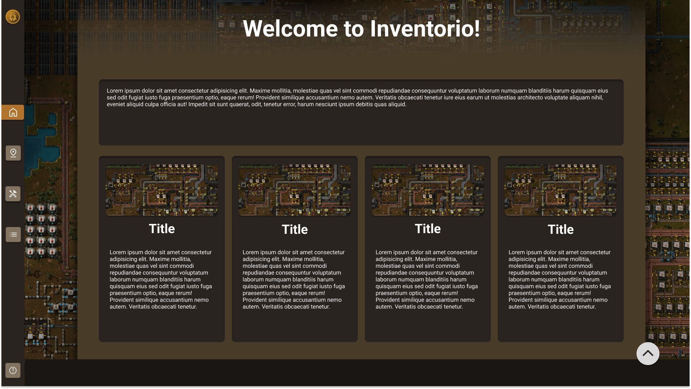

## Repo Info


Reinhardt de Beer 21100115

# INVENTORIO - Development Term 1

Welcome to Inventorio, the ultimate inventory management website for Factorio players! Our website is made with andgular and typescript that is designed to make managing your in-game inventory a breeze. With Inventorio, you can easily add locations, store items inside those locations, add your desired items, and craft items, all with just a few clicks.

## Table of contents

- [Installation](#Installation)
- [Built With](#Build-With)
- [Features](#Features-and-Functions)
- [Development-Process](#Development-Process)
  - [Ideation](#Ideation)
  - [Wireframes](#Wireframes)
  - [Challenges](#Challenges)
  - [Above and Beyond](#Above-And-Beyond)
  - [Future Implementation](#Future-Implementation)
- [Final-Outcome](#Final-Outcome)
  - [Mockups](#Mockups)
- [Authors](#Authors)
- [License](#License)
- [Contact](#Contact)
- [Acknowledgements](#Acknowledgements)

## Installation

1.  GitHub Desktop </br>
    Enter `https://github.com/EpicBlue1/Inventorio_DV300.git` into the URL field and press the `Clone` button.

2.  Clone Repository </br>
    Run the following in the command-line to clone the project:

    ```sh
    git clone https://github.com/EpicBlue1/Inventorio_DV300.git
    ```

        Open `Software` and select `File | Open...` from the menu. Select cloned directory and press `Open` button

3.  Install Dependencies </br>

Run the following in the command-line to install all the required dependencies inside the server and client folder:

```sh
npm i
```

4. An API key is not required

## Build With

| Name           | Link                                       |
| -------------- | ------------------------------------------ | ---------------------------------- | --- |
| <p>Angular</p> | https://angular.io                         |
| <p>Scss</p>    | https://sass-lang.com/documentation/syntax |
| <p>Express</p> | https://expressjs.com/                     |
| <!--           | <p>Bootstrap React</p>                     | https://react-bootstrap.github.io/ | --> |

## Features and Functions

- Log in with different users
- Each user handles their own data
- Add new locations
- Items are saved inside locations
- Search through your items

## Development Process

### Wireframes

Initial wireframes:

<p align="center">
    
</p>
<p align="center">
    
</p>
<p align="center">
    
</p>
<p align="center">
    
</p>

## Challenges

- Rerendering.
- Server communications

## Above And Beyond

- Add Locations and showcase visually
- Each user handles their own data
- Unique design fully created with Ai images

## Future Implementation

- Sort out re-rendering on all pages
- Transfer items to different locations
- Be able to craft
- Tweaking

## Final Outcome

## Mockups

<!-- TODO: Add Mockups -->
<p align="center">
    
    
    <br/>
    
    
</p>

<br/>

## Authors

- **Reinhardt de Beer** - [EpicBlue1](https://github.com/EpicBlue1)

## License

Distributed under the MIT License. See `LICENSE` for more information.

## Contact

- **Reinhardt de Beer** - [21100115@virtualwindow.co.za](mailto:21100115@virtualwindow.co.za) - [@rdb_fotopatat](https://www.instagram.com/rdb_fotopatat/)

- **Project Link** - https://github.com/EpicBlue1/Inventorio_DV300

## Acknowledgements

- **Icons** - [SWM Icon Pack](<https://www.figma.com/file/Y06WSIqH4hJ6UpGAlbBKvu/SWM-Icon-Pack-(Community)?node-id=202%3A304>)
